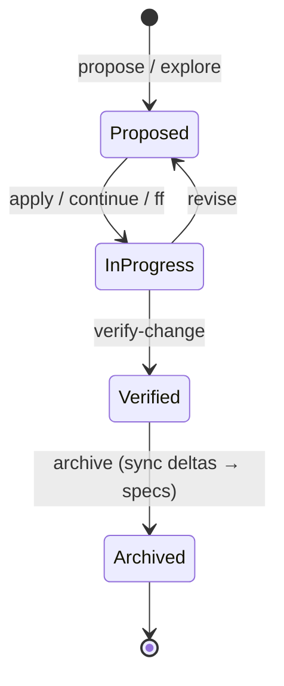

# OpenSpec Client Coverage

How this plugin maps to the [OpenSpec](https://github.com/fission-ai/openspec) client — what's supported, what's partial, and what's on the roadmap. The plugin's goal is to be a **faithful companion to the OpenSpec client**, not a divergent reimplementation, so this matrix is the project's parity north-star.

**Status:** ✅ Supported · 🟡 Partial · ⚠️ Divergent (reimplemented, being aligned) · 🔜 Planned · 🧩 Plugin-original (no client equivalent)

**CLI column** — the relationship to the installed OpenSpec CLI:
- `built-in` — the plugin implements this itself; works regardless of CLI (even with no CLI installed)
- `1.3+` — needs the CLI floor
- `1.4+` — needs a 1.4-line CLI
- `1.4.x` — exists only in the `[1.4.0, 1.5.0)` window (the command was removed in 1.5.0)
- `delegated` — runs against the CLI at runtime; degrades to a built-in path / guidance below the floor

## Version support

- **Minimum CLI: 1.3.0.** Below the floor, the plugin shows a one-time upgrade nudge and degrades gracefully to its built-in paths (project detection, init, spec browser, tool window, validation).
- **Baseline: the 1.4.x line** (tested against 1.4.1).
- **1.5.x line:** CLI 1.5.0 replaced the 1.4 coordination commands with the **store / workset** model. The plugin reads that model **read-only** above a `1.5.0` store floor (evaluated from the detected CLI version), with a built-in fallback that reads the global data dir directly. Store/workset **write actions are deferred**.
- The plugin is **runtime-version-aware**: recognized schema names are the union of its built-in set and the live `openspec schemas` list, and version-sensitive behavior is gated on the detected CLI version.
- **Independent axis:** the checked-in config format (`openspec/config.yaml` `version: 1.2.0`) is *not* the CLI version. It is unchanged across CLI 1.2.x / 1.3.x / 1.4.x.

> Verified by comparing CLI 1.3.1 ↔ 1.4.0: all change-lifecycle workflows (incl. `verify-change`) and the `status` / `instructions` / `templates` / `schemas` / `validate` / `show` commands exist at the 1.3 floor. The `workspace-planning` schema and the `workspace` / `context-store` / `initiative` / `set` commands are 1.4 additions.
>
> **CLI 1.5.0 removed the `workspace` / `context-store` / `initiative` commands and the `workspace-planning` schema** (replaced by the `store` / `workset` model). The plugin's built-in schema set is therefore `spec-driven` only, and coordination is gated to the `[1.4.0, 1.5.0)` window — on a 1.5.0+ CLI the plugin never invokes the removed commands and the Coordination tab stands down (read-only Awareness if legacy on-disk state exists, Hidden otherwise).

## Change-lifecycle workflows

| Workflow | Status | CLI | Notes |
|----------|--------|-----|-------|
| propose / new | ✅ | built-in | Built-in scaffolding (full artifact set) + AI skill |
| explore | ✅ | built-in · `instructions` | Thinking-space panel + AI skill |
| apply-change | ✅ | built-in · `status` | Implement-tasks action + AI skill |
| continue-change | ✅ | built-in · `status` | Resume action |
| ff-change | ✅ | built-in | Fast-forward action |
| sync-specs | ✅ | built-in | Built-in delta→main spec sync + AI skill |
| archive-change | ✅ | `delegated` | Archive action (applies deltas + moves) + AI skill |
| bulk-archive | ✅ | built-in | Bulk archive action |
| **verify-change** | 🟡 | `1.3+` · `delegated` | Rebuilt to be schema/mode-aware (drives off `openspec status` `actionContext.mode`) and **language-agnostic**: a deterministic completeness gate plus semantic correctness/coherence delegated to the AI bridge. Non-default modes (e.g. `workspace-planning`) explain and stop. The old Java-only code heuristic is retired. |
| onboard | 🟡 | built-in | Plugin's own Setup Wizard, not the OpenSpec `onboard` workflow |
| feedback | 🔜 | `1.3+` | No surface yet for `openspec feedback` |

## Model & CLI surfaces

| Surface | Status | CLI | Notes |
|---------|--------|-----|-------|
| init / update / list / show | ✅ | built-in · `delegated` | Actions + tool-window tree |
| validate | ✅ | built-in | Built-in delta-spec + config validation, aligned to the client's rules |
| delta specs (ADDED/MODIFIED/REMOVED/RENAMED) | ✅ | built-in | Create / inspect / diff / sync. `RENAMED` support tracks the 1.4 client addition but is implemented built-in (works at the floor). |
| status | 🟡 | `1.3+` | Used by apply/continue/list; not yet by Verify |
| instructions | 🟡 | `1.3+` | Used by Explore; not yet broadly |
| view (dashboard) | 🟡 | built-in | Plugin tool-window tree rather than the CLI `view` dashboard |
| templates | 🔜 | `1.3+` | Not surfaced |

## Schemas & profiles

| Capability | Status | CLI | Notes |
|------------|--------|-----|-------|
| `spec-driven` schema | ✅ | `1.3+` | Fully supported |
| `workspace-planning` schema | 🟡 | `1.4+` | Recognized & validated; workflow surfaces detect and reflect the active `actionContext.mode`, and Verify mode-gates it (explains repo-local verify N/A). Full per-mode authoring UX still in progress |
| custom / forked schemas | 🟡 | `1.3+` | A forked schema name is recognized rather than flagged unknown |
| profiles / config | ✅ | `delegated` | CLI-aligned profile picker; config validation |

## Coordination layers

> **1.4-line client commands** (`workspace` / `context-store` / `initiative`), surfaced by the plugin's **Coordination** tab — CLI-sourced (`list`/`doctor`) within the window `[1.4.0, 1.5.0)`, with a built-in fallback that reads the global data dir directly. **CLI 1.5.0 removed these commands** (replaced by the store/workset model), so on a 1.5.0+ CLI the plugin never invokes them: the tab stands down to read-only Awareness when legacy on-disk state exists, and Hidden otherwise. The tab is shown only when coordination state or a coordination mode is detected.

| Capability | Status | CLI | Notes |
|------------|--------|-----|-------|
| workspace | ✅ | `1.4.x` | Listed with resolution health; set-up action (Full tier); read-only fallback from the on-disk registry. Removed in CLI 1.5.0 → tab stands down. |
| context-store | ✅ | `1.4.x` | Listed with id/root and doctor health; set-up/register action (Full tier); read-only fallback. Removed in CLI 1.5.0 → tab stands down. |
| initiative | ✅ | `1.4.x` | Listed with lifecycle status badge; artifacts open in the editor; create action (Full tier); read-only fallback from `initiative.yaml`. Removed in CLI 1.5.0 → tab stands down. |

## Stores & worksets (1.5)

> **1.5-line client model** (`store` / `workset`), replacing the 1.4 coordination layer. Surfaced **read-only** by the Coordination tab when the detected CLI is at or above the `1.5.0` store floor — CLI-sourced (`store list` / `store doctor` / `workset list`) with a built-in fallback that reads the global data dir directly (`stores/registry.yaml`, `worksets/worksets.yaml`). The store registry is byte-identical in shape to the 1.4 context-store registry, so the same backend-local-path reader serves both. At CLI ≥ `1.5.0`, stores/worksets are the lead model and any surviving pre-1.5 state is demoted to a muted, read-only "Legacy (pre-1.5)" group. **Write actions are deferred.** The plugin performs no migration.

| Capability | Status | CLI | Notes |
|------------|--------|-----|-------|
| store | ✅ 🧩 | `1.5+` · `built-in` | Listed with id/root and `store doctor` health (metadata present/valid, git repository, openspec-root healthy); diagnostic `fix` shown read-only. CLI-sourced above the `1.5.0` floor; `built-in` on-disk fallback reads `stores/registry.yaml`. Read-only — write actions deferred. |
| workset | ✅ 🧩 | `1.5+` · `built-in` | Listed with members (`name` + `path`) as child rows. CLI-sourced above the `1.5.0` floor; `built-in` on-disk fallback reads `worksets/worksets.yaml`. Read-only — write actions deferred. |

## IDE value-add (plugin-original)

| Capability | Status | Notes |
|------------|--------|-------|
| Spec syntax highlighting | ✅ 🧩 | RFC-2119 + scenario keyword highlighting |
| Delta-spec inline inspection | ✅ 🧩 | Real-time structural checks + quick-fixes |
| Delta-spec diff viewer | ✅ 🧩 | Side-by-side delta vs main spec |
| Tool-window workflow panel | ✅ 🧩 | Change tree + workflow actions |
| Coordination tab (1.4) | ✅ 🧩 | Tiered Hidden/Awareness/Full surface for workspaces, context stores, initiatives |
| Store/workset read surface (1.5) | ✅ 🧩 | Read-only tab presentation of 1.5 stores (with `doctor` health) and worksets, gated at the `1.5.0` floor, with legacy pre-1.5 state demoted; write actions deferred |
| Setup wizard | ✅ 🧩 | Guided onboarding & CLI detection |

## Lifecycle at a glance

## Roadmap

The frontier, in dependency order:

1. **Foundation — schema/version awareness.** Make workflow surfaces drive off `openspec status` / `instructions` (the schema + `actionContext.mode`) instead of assuming a `spec-driven` layout. Unblocks faithful Verify and correct behavior on non-default schemas.
2. **Workflow-surface fidelity.** Rebuild **Verify** as a faithful `verify-change` surface (semantic, language-agnostic, schema-aware); fill remaining workflow gaps (`feedback`, an `onboard`-aligned path).
3. **Coordination layers (1.4).** ✅ Shipped — the Coordination tab surfaces `workspace` / `context-store` / `initiative` for cross-area / multi-repo coordination (read-only without a 1.4 CLI; actions and artifact navigation with one). Remaining polish: per-mode authoring UX and richer initiative editing.

> Each row's "delivered by" history lives in [`CHANGELOG.md`](../CHANGELOG.md) and the archived OpenSpec changes under `openspec/changes/archive/`.
