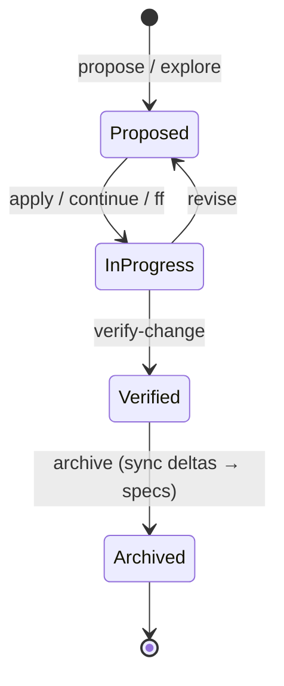
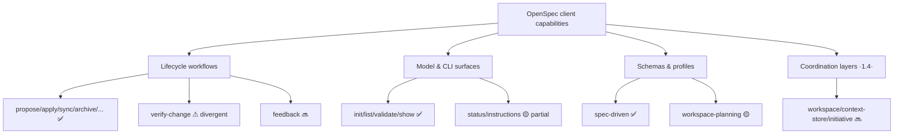
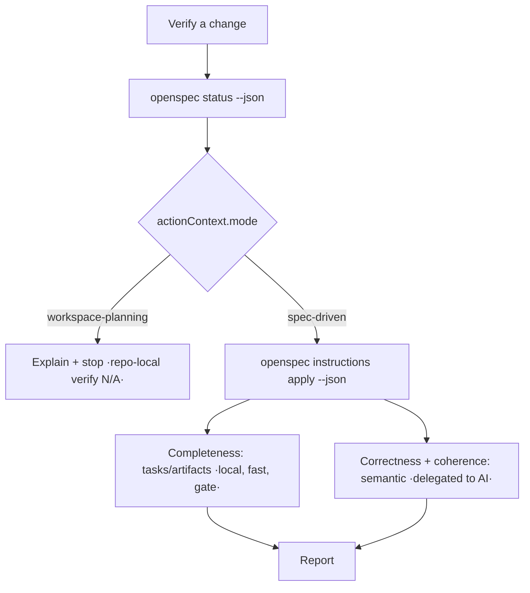

# Design

## Goal

A single, maintained, **version-aware** statement of how the plugin maps to the OpenSpec client — usable by users ("do I need a newer CLI for X?") and by contributors (the parity north-star).

## Why a coverage matrix (and not just feature docs)

The plugin is a wrapper whose value is fidelity to the client. Feature docs describe what the plugin *does*; a coverage matrix describes the plugin *relative to the client*, which is the dimension that actually defines this product. It also makes "divergent" surfaces (reimplementations that drift from the client) explicit, so they can be driven back toward fidelity.

## Version model (verified)

Two independent axes — conflating them would make the matrix wrong:

1. **CLI version** — the installed OpenSpec client. Floor 1.3.0; baseline the 1.4.x line.
2. **Config-format version** — `openspec/config.yaml` `version: 1.2.0`, unchanged across CLI 1.2.x / 1.3.x / 1.4.x.

Empirical 1.3.1 ↔ 1.4.0 comparison:

| Capability area | 1.3.1 | 1.4.0 |
|---|---|---|
| All lifecycle workflows incl. `verify-change` | present | present |
| `status` / `instructions` / `templates` / `schemas` | present | present |
| `workspace-planning` schema | — | added |
| `workspace` / `context-store` / `initiative` / `set` commands | — | added |

Consequence: the matrix carries a per-row CLI annotation (`built-in` / `1.3+` / `1.4+` / `delegated`); most plugin capabilities are `built-in` or `1.3+`, and the unsupported coordination layer aligns exactly with the 1.4 additions.

## Lifecycle

## Coverage at a glance (workflow × support)

## Phase decomposition (the workflow-fidelity effort)

The matrix's gaps cluster into three phases, in dependency order. Each phase is realized as its own OpenSpec change(s); this change only publishes the matrix + the plan.

1. **Foundation — schema/version awareness.** Make workflow surfaces drive off `openspec status` / `instructions` (schema + `actionContext.mode`) rather than assuming a `spec-driven` layout. Prerequisite for faithful Verify and correct behavior on non-default schemas.
2. **Workflow-surface fidelity.** Rebuild **Verify** as a faithful `verify-change` surface — schema-aware, semantic, language-agnostic — and fill remaining workflow gaps (`feedback`, `onboard`-aligned path). The Verify rebuild also retires a residual language-gated heuristic.
3. **Coordination layers.** Surface the 1.4 additions (`workspace` / `context-store` / `initiative`) for cross-area / multi-repo coordination — the largest, latest frontier.

## Faithful-Verify target (Phase 2 preview)

## Tracking convention (dual-layer)

- **Public layer** — the matrix and the published change artifacts reference only public identifiers: support status, CLI version, OpenSpec change names, and CHANGELOG versions. No internal tracker identifiers.
- **Internal layer** — the project's internal tracker holds the epic/phase grouping and the per-change cross-references. It is never written into published artifacts.

This mirrors the existing per-change sidecar convention: planning artifacts stay public-neutral; internal identifiers live only in the internal layer.

## Decisions

- **One matrix, annotated — not parallel per-version matrices.** A single CLI-version column captures the 1.3↔1.4 distinction with far less maintenance.
- **No per-cell commit SHAs.** Durable provenance is the OpenSpec change name + CHANGELOG version; SHAs go stale.
- **Standalone doc** (`docs/openspec-support.md`) rather than folding into the feature reference — it answers a different question (parity, not features).

## Out of scope

- Implementing any phase (schema-aware Verify, coordination layers) — separate changes.
- A reconciliation of the `plugin-documentation` "Spec Browser" scenario that still references the retired coverage/gutter surfaces — noted as a separate cleanup.
