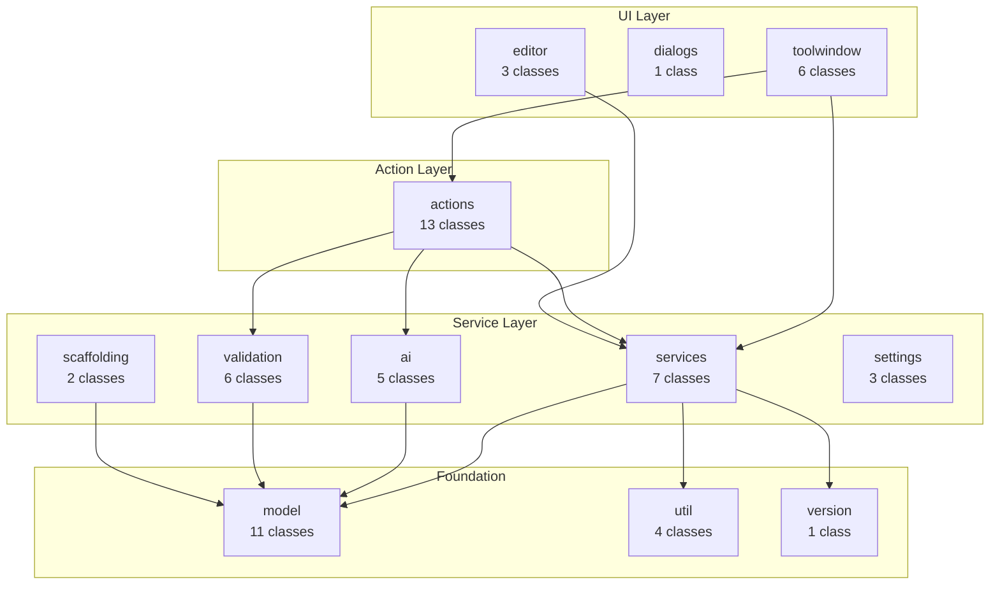
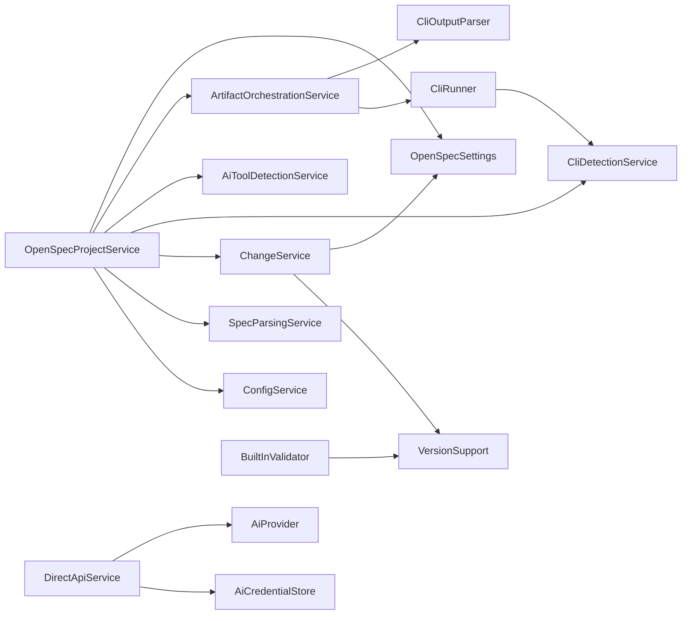
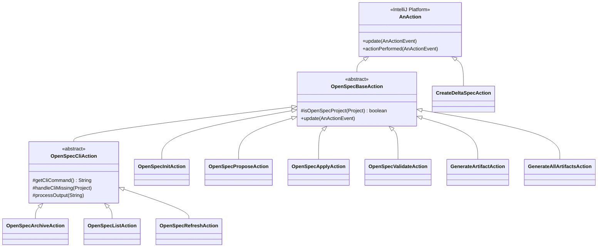
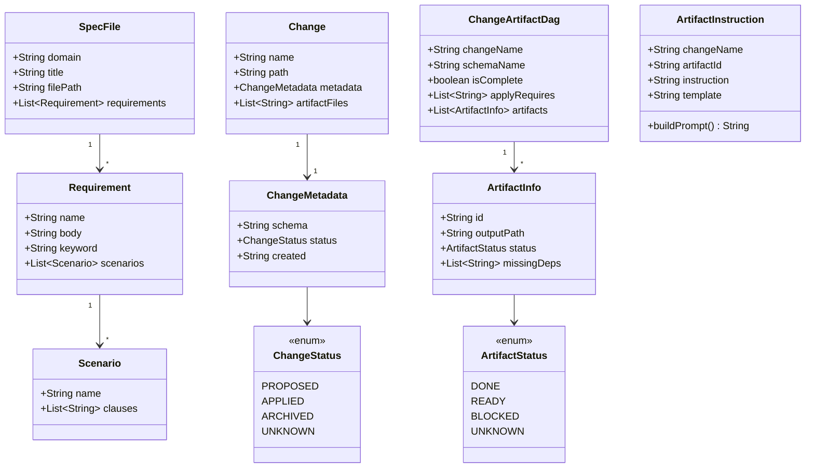
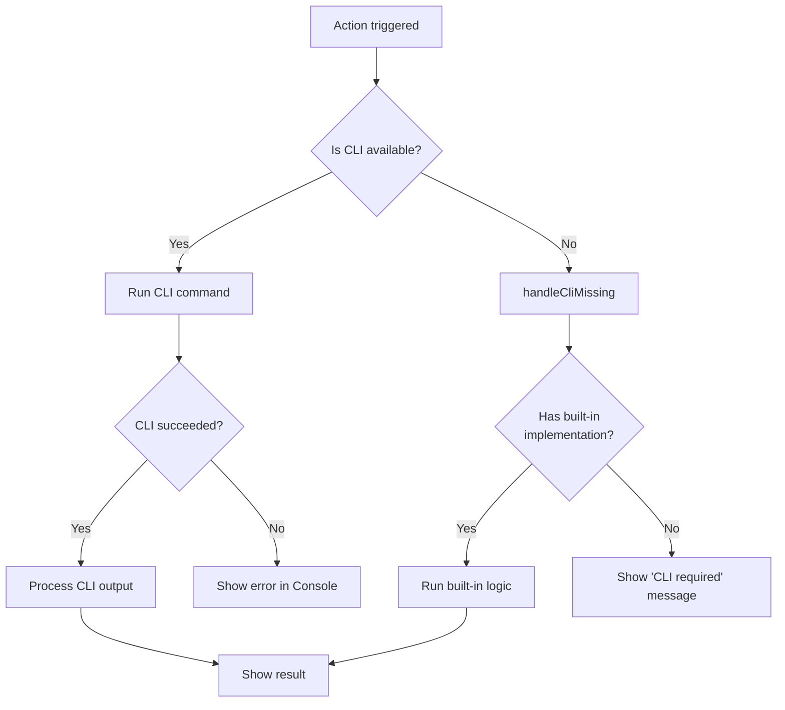

# Architecture Overview

The OpenSpec plugin is organized into 13 packages with clear layer separation. This page provides visual architecture diagrams.

## Package Architecture

## Service Dependency Graph

## Action Class Hierarchy

## Data Model

## Tree Model Structure

```mermaid
graph TD
    root["OpenSpec (root)"] --> specs["Specs"]
    root --> changes["Changes"]
    root --> archive["Archive"]

    specs --> d1["domain-1/"]
    specs --> d2["domain-2/"]
    d1 --> s1["spec.md"]
    s1 --> r1["Requirement 1"]
    s1 --> r2["Requirement 2"]

    changes --> c1["change-1 &#91;proposed&#93;"]
    changes --> c2["change-2 &#91;applied&#93;"]
    c1 --> a1["✓ proposal.md"]
    c1 --> a2["○ design.md"]
    c1 --> a3["− tasks.md"]
    c1 --> ds["delta-specs/"]
    ds --> ds1["actions.md"]

    archive --> ac1["old-change &#91;archived&#93;"]
```

**Node data is stored as `TreeNodeData` records** with: `label`, `type` (TreeNodeType enum), `filePath`, `changeName`, `artifactId`.

## CLI/Built-in Hybrid Flow

This hybrid approach ensures the plugin is functional without the CLI while providing enhanced features when it's available.

---

**Previous:** [[Troubleshooting]] | **Next:** [[Package-Reference]]
