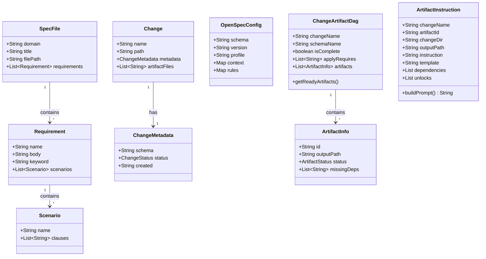

# Data Model

This page documents all model classes, their fields, and relationships.

## Class Diagram

## Spec Domain

### SpecFile

Represents a parsed `spec.md` file.

| Field | Type | Source |
|-------|------|--------|
| `domain` | `String` | Parent directory name (e.g., `"actions"`) |
| `title` | `String` | First `#` heading in the spec |
| `filePath` | `String` | Absolute path to the file |
| `requirements` | `List<Requirement>` | Parsed `##` sections |

### Requirement

An individual requirement within a spec.

| Field | Type | Source |
|-------|------|--------|
| `name` | `String` | The `##` heading text |
| `body` | `String` | Full text of the requirement |
| `keyword` | `String` | RFC 2119 keyword (MUST, SHOULD, MAY, etc.) or null |
| `scenarios` | `List<Scenario>` | Parsed scenario blocks |

### Scenario

A GIVEN/WHEN/THEN test scenario.

| Field | Type | Source |
|-------|------|--------|
| `name` | `String` | Scenario label |
| `clauses` | `List<String>` | Individual GIVEN, WHEN, THEN, AND lines |

## Change Domain

### Change

Represents a change directory under `openspec/changes/`.

| Field | Type | Source |
|-------|------|--------|
| `name` | `String` | Directory name |
| `path` | `String` | Absolute path |
| `metadata` | `ChangeMetadata` | Parsed from `.openspec.yaml` |
| `artifactFiles` | `List<String>` | Filenames found in change directory |

### ChangeMetadata

YAML-serializable metadata from `.openspec.yaml`.

| Field | Type | Source |
|-------|------|--------|
| `schema` | `String` | Schema version (e.g., `"v1.2"`) |
| `status` | `ChangeStatus` | Current status |
| `created` | `String` | ISO date string |

### ChangeStatus (enum)

| Value | Label | Description |
|-------|-------|-------------|
| `PROPOSED` | `"proposed"` | Change has been proposed, artifacts being generated |
| `APPLIED` | `"applied"` | Implementation complete |
| `ARCHIVED` | `"archived"` | Moved to archive directory |
| `UNKNOWN` | `"unknown"` | Status could not be determined |

Methods: `fromString(String)`, `toLabel()`

## Artifact Domain

### ChangeArtifactDag

Dependency graph for a change's artifacts. Returned by CLI `openspec artifact --status`.

| Field | Type | Description |
|-------|------|-------------|
| `changeName` | `String` | Change this DAG belongs to |
| `schemaName` | `String` | Schema version |
| `isComplete` | `boolean` | All artifacts are DONE |
| `applyRequires` | `List<String>` | Artifacts needed before apply |
| `artifacts` | `List<ArtifactInfo>` | All artifacts in the graph |

Methods: `getReadyArtifacts()` — filters to status == READY

### ArtifactInfo

Metadata for a single artifact in the DAG.

| Field | Type | Description |
|-------|------|-------------|
| `id` | `String` | Artifact identifier (e.g., `"design"`, `"tasks"`) |
| `outputPath` | `String` | Relative path to artifact file |
| `status` | `ArtifactStatus` | Current generation status |
| `missingDeps` | `List<String>` | IDs of dependencies not yet DONE |

### ArtifactStatus (enum)

| Value | Icon | Description |
|-------|------|-------------|
| `DONE` | ✓ | Artifact file exists and is complete |
| `READY` | ○ | All dependencies met, ready to generate |
| `BLOCKED` | − | Waiting on dependencies |
| `UNKNOWN` | ? | Status could not be determined |

Method: `toIcon()` — returns the symbol character

### ArtifactInstruction

Full instruction context for generating an artifact.

| Field | Type | Description |
|-------|------|-------------|
| `changeName` | `String` | Parent change |
| `artifactId` | `String` | Which artifact to generate |
| `changeDir` | `String` | Path to change directory |
| `outputPath` | `String` | Where to write the result |
| `instruction` | `String` | Generation instruction text |
| `template` | `String` | Expected output format/template |
| `dependencies` | `List` | Resolved dependency contents |
| `unlocks` | `List` | Downstream artifacts this enables |

Method: `buildPrompt()` — assembles the complete prompt from instruction + template + dependency contents

## Config Domain

### OpenSpecConfig

YAML-serializable model for `openspec/config.yaml`.

| Field | Type | Description |
|-------|------|-------------|
| `schema` | `String` | Schema version |
| `version` | `String` | Project version |
| `profile` | `String` | Active profile name |
| `context` | `Map` | Project context metadata |
| `rules` | `Map` | Validation rule overrides |

---

**Previous:** [[Actions-and-Commands]] | **Next:** [[UI-Components]]
