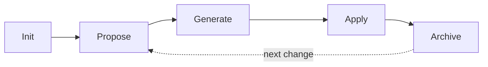
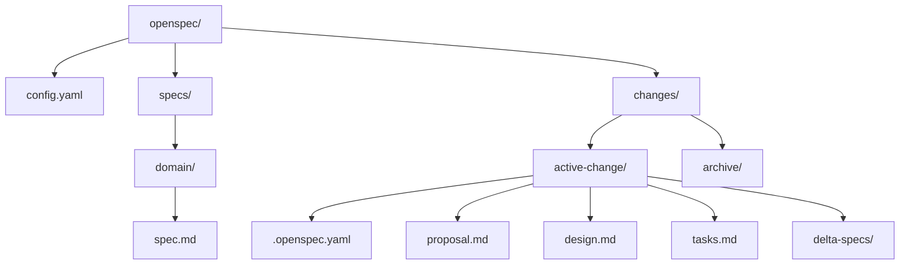

# Getting Started

OpenSpec follows a five-step spec-driven workflow. This guide walks through each step.

## The OpenSpec Workflow



## Step 1: Initialize

**OpenSpec → Init** creates the project structure:

```
openspec/
├── config.yaml          # Project configuration
└── specs/
    └── core/
        └── spec.md      # Your first spec
```

The `config.yaml` defines your schema version, profile, and project context. The scaffolding service generates a starter spec with placeholder requirements.

## Step 2: Propose a Change

**OpenSpec → Propose** creates a new change:

1. A dialog asks for the change name and description
2. The plugin creates:

```
openspec/changes/<change-name>/
├── .openspec.yaml       # Metadata (schema, status: proposed)
├── proposal.md          # What and why
├── design.md            # Technical approach (artifact)
├── tasks.md             # Implementation tasks (artifact)
└── delta-specs/         # Spec modifications
```

## Step 3: Generate Artifacts

Use **OpenSpec → Generate Artifact** on a specific artifact, or **Generate All Artifacts** to walk the dependency graph automatically.

Three delivery modes are available:

| Mode | How it works | Requires |
|------|-------------|----------|
| **Clipboard** | Copies AI prompt to clipboard for pasting into any AI tool | Nothing |
| **Editor Tab** | Opens prompt in a new editor tab | Nothing |
| **Direct API** | Calls Claude/OpenAI API, writes result to file | API key configured |

The artifact DAG ensures dependencies are generated in the correct order (e.g., design before tasks).

## Step 4: Apply

**OpenSpec → Apply** marks the change as applied once you've implemented the tasks. The change status moves from `proposed` → `applied`.

## Step 5: Archive

**OpenSpec → Archive** moves the completed change to the archive:

```
openspec/changes/archive/<change-name>/
```

This keeps your active changes directory clean while preserving history.

## Directory Structure



## What's Next?

- [[Tool-Window-Guide]] — Browse specs, changes, and artifacts visually
- [[AI-Configuration]] — Set up API keys for Direct API mode
- [[Workflow-Patterns]] — Choose the right workflow for your setup

---

**Previous:** [[Installation]] | **Next:** [[Tool-Window-Guide]]
