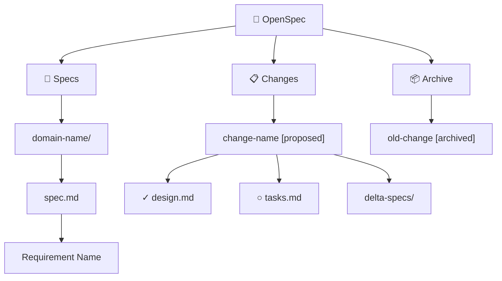

# Tool Window Guide

The OpenSpec tool window provides a visual overview of your project's specs, changes, and artifacts. It appears on the **right sidebar** of IntelliJ IDEA.

## Tabs

The tool window has two tabs:

| Tab | Purpose |
|-----|---------|
| **Browse** | Tree view of specs, changes, and artifacts |
| **Console** | CLI command output log |

## Tree Structure

### Node Types

| Node Type | Icon | Description |
|-----------|------|-------------|
| **SPECS** | 📄 | Root of all specifications |
| **SPEC_DOMAIN** | 📁 | Domain folder (e.g., `actions/`, `editor/`) |
| **REQUIREMENT** | ◆ | Individual requirement from a spec |
| **CHANGES** | 📋 | Root of active changes |
| **CHANGE** | 📝 | A single change with status label |
| **ARTIFACT_DONE** | ✓ | Completed artifact (green) |
| **ARTIFACT_READY** | ○ | Ready to generate (blue, bold) |
| **ARTIFACT_BLOCKED** | − | Waiting on dependencies (gray, italic) |
| **MISSING_ARTIFACT** | ⚠ | Expected but not yet created |
| **DELTA_SPEC** | 📑 | Delta spec file |
| **ARCHIVE** | 📦 | Root of archived changes |
| **HINT** | 💡 | Informational hint (gray, italic) |

### Status Colors

| Change Status | Color |
|---------------|-------|
| `proposed` | Green |
| `applied` | Blue |
| `archived` | Default |

### Artifact View Modes

When the **CLI is available**, artifacts show DAG-based status (done/ready/blocked with dependency info). When running in **built-in mode**, the tree shows file-based view with missing artifact detection.

## Interactions

### Double-Click
Opens the associated file in the editor. Works on specs, artifacts, delta specs, and proposals.

### Right-Click Context Menu
Context-sensitive actions based on node type:

| Node | Available Actions |
|------|-------------------|
| **Change** | Apply, Archive, Generate All |
| **Artifact (ready)** | Generate Artifact |
| **Spec / Delta Spec** | Validate |

### Toolbar
The toolbar at the top of the Browse tab provides quick access to:
- Refresh Tree
- Validate
- Propose
- Apply / Archive
- Generate Artifact / Generate All

## Status Bar

The bottom of the tool window shows:
- **CLI version** (or "built-in mode" if CLI not found)
- **Detected AI tools** (Claude, GitHub Copilot, Cursor, Windsurf, Cline)

## Auto-Refresh

When enabled in settings (**Settings → Tools → OpenSpec → Auto-refresh**), the tree automatically updates when files change inside the `openspec/` directory. Changes are debounced with a 300ms delay to avoid excessive rebuilds.

---

**Previous:** [[Getting-Started]] | **Next:** [[Menu-and-Actions-Reference]]
