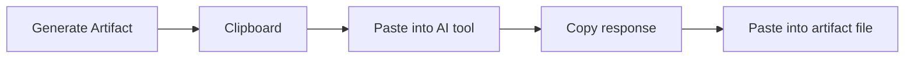
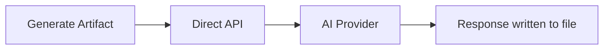

# Workflow Patterns

OpenSpec supports three workflow patterns depending on your setup and preferences.

## Pattern 1: Clipboard Workflow

**Best for:** Teams without API keys, users who prefer their own AI tools.

**Steps:**
1. Select an artifact in the tree
2. **Generate Artifact → Clipboard**
3. Paste the prompt into Claude, ChatGPT, Cursor, etc.
4. Copy the AI response back into the artifact file

**Pros:** No API key needed, use any AI tool, full control over the interaction.
**Cons:** Manual copy-paste, slower iteration.

## Pattern 2: Direct API Workflow

**Best for:** Solo developers, rapid prototyping, automated pipelines.

**Steps:**
1. Configure AI provider and API key (see [[AI-Configuration]])
2. Select an artifact or use **Generate All Artifacts**
3. The plugin calls the API and writes the result directly

**Pros:** Fully automated, supports Generate All for batch processing.
**Cons:** Requires API key, costs per API call, less control over prompting.

## Pattern 3: Mixed Workflow

**Best for:** Most teams — use Direct API for routine artifacts, clipboard for critical ones.

**Example flow:**
1. **Generate All** to auto-generate `design.md` and `tasks.md`
2. Review generated content
3. For delta specs, use **Clipboard** mode to have a detailed conversation with AI
4. Manually refine as needed

## Choosing a Pattern

| Factor | Clipboard | Direct API | Mixed |
|--------|-----------|------------|-------|
| API key required | No | Yes | Yes |
| Speed | Slow | Fast | Medium |
| Control | Full | Limited | Balanced |
| Batch generation | No | Yes | Partial |
| Cost | Free | Per-call | Per-call |

## CLI vs. Built-in Mode

Both workflow patterns work in either mode:

| Feature | With CLI | Built-in Only |
|---------|----------|---------------|
| Init | CLI scaffolding | Built-in scaffolding |
| Propose | CLI + templates | Dialog + ScaffoldingService |
| Validate | Merged results | Built-in rules only |
| Archive | CLI moves files | Built-in file operations |
| Artifact DAG | Full DAG from CLI | File-based detection |
| Generate | Full prompt context | Basic prompt building |

The CLI provides richer artifact dependency information and validation rules. Built-in mode covers core workflows without external dependencies.

---

**Previous:** [[Validation]] | **Next:** [[Troubleshooting]]
